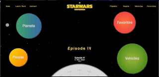
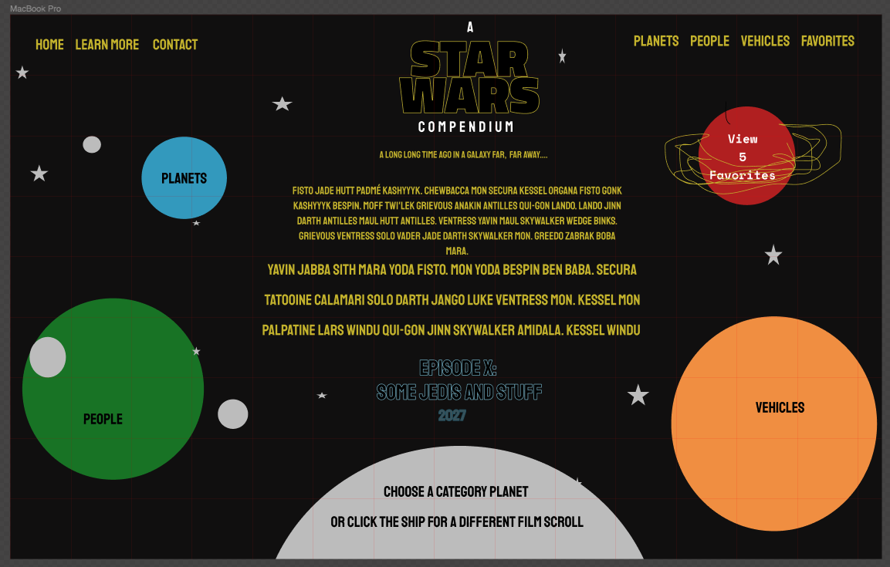
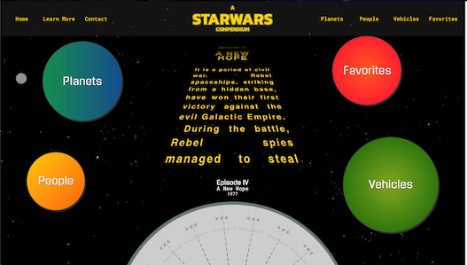

# SWAPI-BOX
+ Solo project, part of the requirements of Module 3 (of 4) at Turing Software and Design  
+ Third project ever built in React, first time using async JavaScript and fetch calls to a remote API  
+ Created using the [Star Wars API](https://swapi.co/) 
+ Progress shown was completed in about five days.

## Demo

## Project Goals & Requirements:
+ Learn how to wireframe and know why it is important.
+ Write squeaky clean, well refactored code using ES6 & ES7 syntax.
+ Make informed design decisions to create a user-friendly application.
+ Keep state based components to a minimum and leverage more functional components.
+ Use a modular architecture for your application file structure.
+ Think deeply about React Lifecycle Methods.
+ Use propTypes for every component receiving props.

### Future Iterations 
+ "Cleaner" functions to return appropriate information for planets and vehicles
+ Incorporate error handling
+ Add favorites functionality
+ Thorough testing suite
+ Incorporate React Router for links in nav bar
+ Logo should return user to home page
+ Mobile friendly ui

## Wireframe

## Submitted Version

